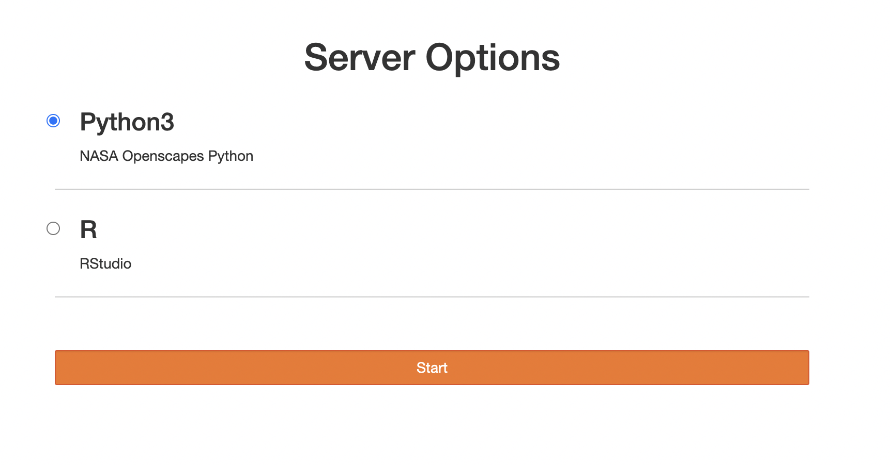
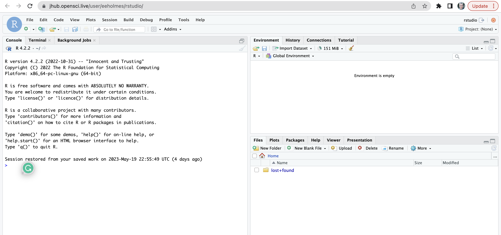
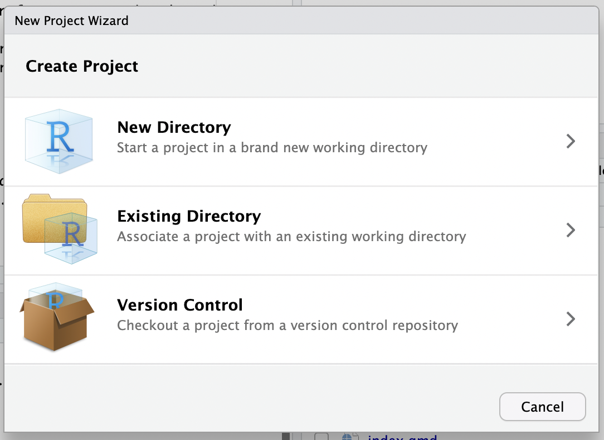
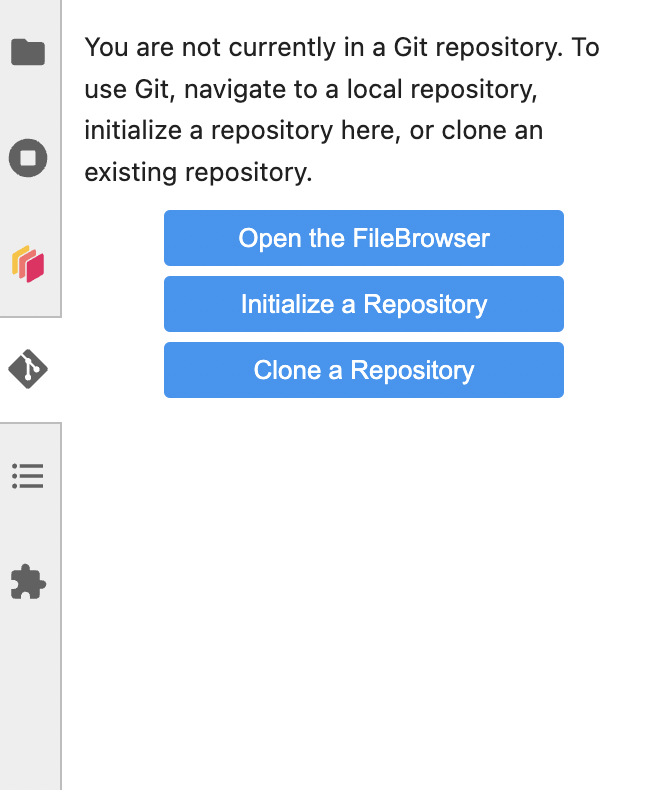

# Instructions

## Login

<https://jhub.opensci.live/hub/login>

You will see this. Choose Python for Python only; choose R for Python and R.



## Spin up your server

You will see this as your server spins up


## Choose your platform

You can code in RStudio, JupyterLab or Terminal.


## Let's choose RStudio



### Clone a repo

Choose 'new project' (top right) and Version Control.



### Tell Git who you are

Tell Git who you are and save your authentication info. You only do this once (or until your PAT expires). Run this code from the R console (not terminal).

```         
usethis::use_git_config(user.name = "YourName", user.email = "your@email.com")
```

Now create a personal access token for authentication. SAVE the token because you will need it in the next step.

```         
usethis::create_github_token() 
```

Now run this and paste in the token.

```         
gitcreds::gitcreds_set()
```

Restart R. You can chose your project from the dropdown on the top right to do this.

Now commit a change and push.

*Note, you can also run the commands below from a terminal window.*

```         
git config --global user.name "YourName"
git config --global user.email "your@email.com"
git config --global credential.helper store
```

## Let's choose JupyterLab

Any of the browser tabs with the Jupyter icon are JupyterLab.

Be careful because you can be in RStudio with one GitHub repository and you could open the same repo in JupyterLab and easily create merge conflicts. Just be aware that they are in separate file systems so changes on RStudio will not be reflected in JupyterLab. It is not like you are on one computer.

### Tell Git who you are

*But I just did that with RStudio!* I know but the JLab instance is in a different environment and doesn't know what you did in the RStudio environment.

Open a terminal. You do this from the Launcher window. You can always open a new launcher window by clicking the little + tab


Now click Terminal and run this code

```         
git config --global user.name "YourName"
git config --global user.email "your@email.com"
git config --global credential.helper store
```

-   Create a PAT or use the one you created for RStudio

-   Make a commit and push with the PAT as the password. Now you are set (until your PAT expires).

### Clone a Git repo

Click the Git icon on the left and you can clone a repo.



## Stop your server

It will stop on it's own after awhile, but if it hangs, you can stop it and restart it. With File \> Hub Control Panel
