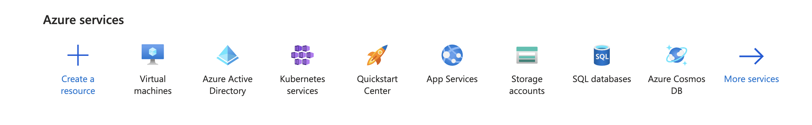
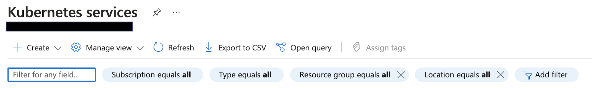
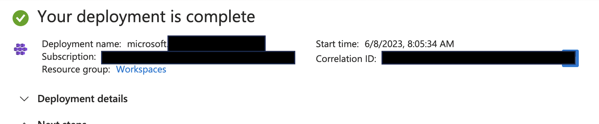
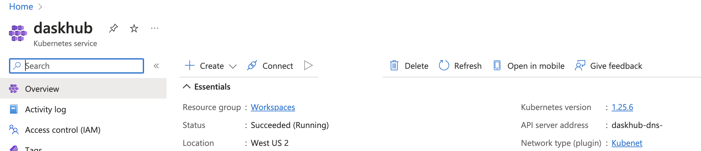
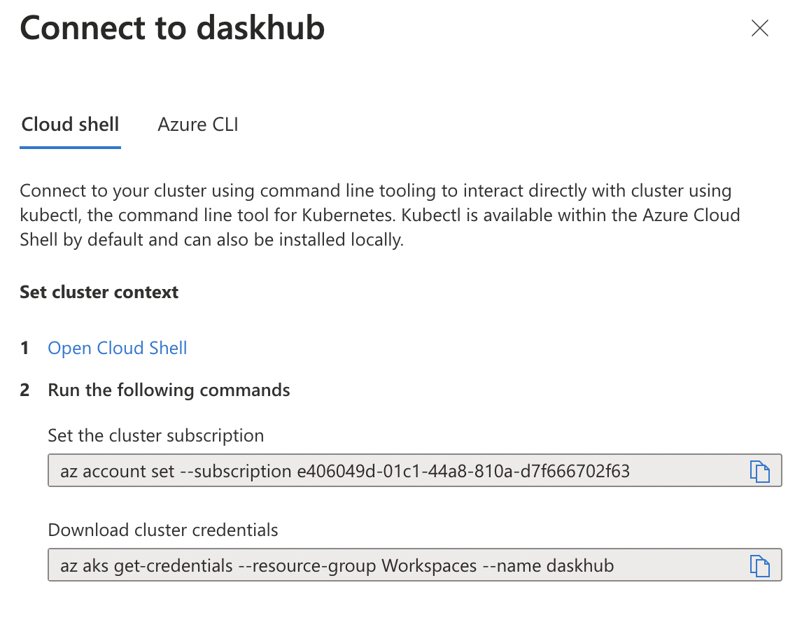
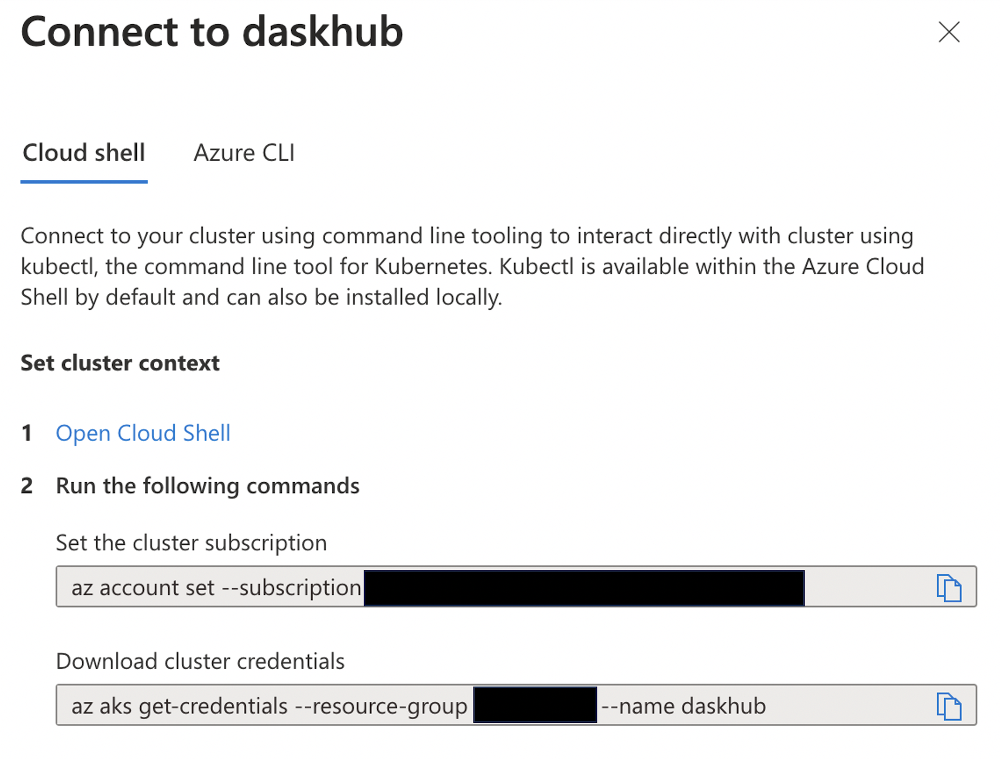
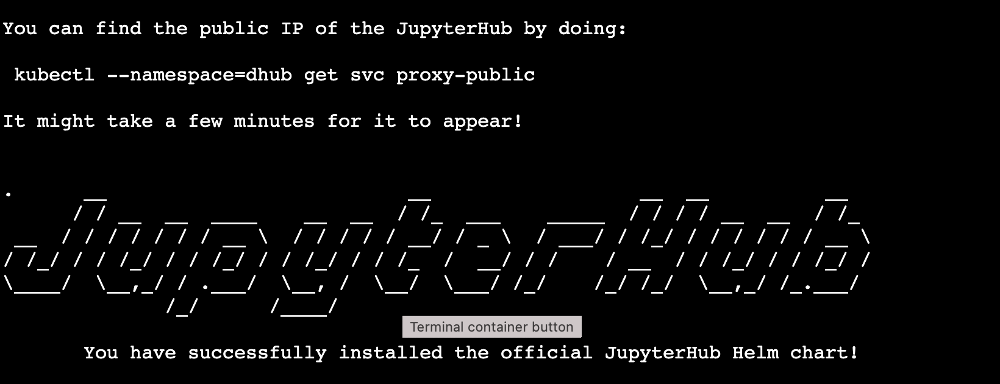
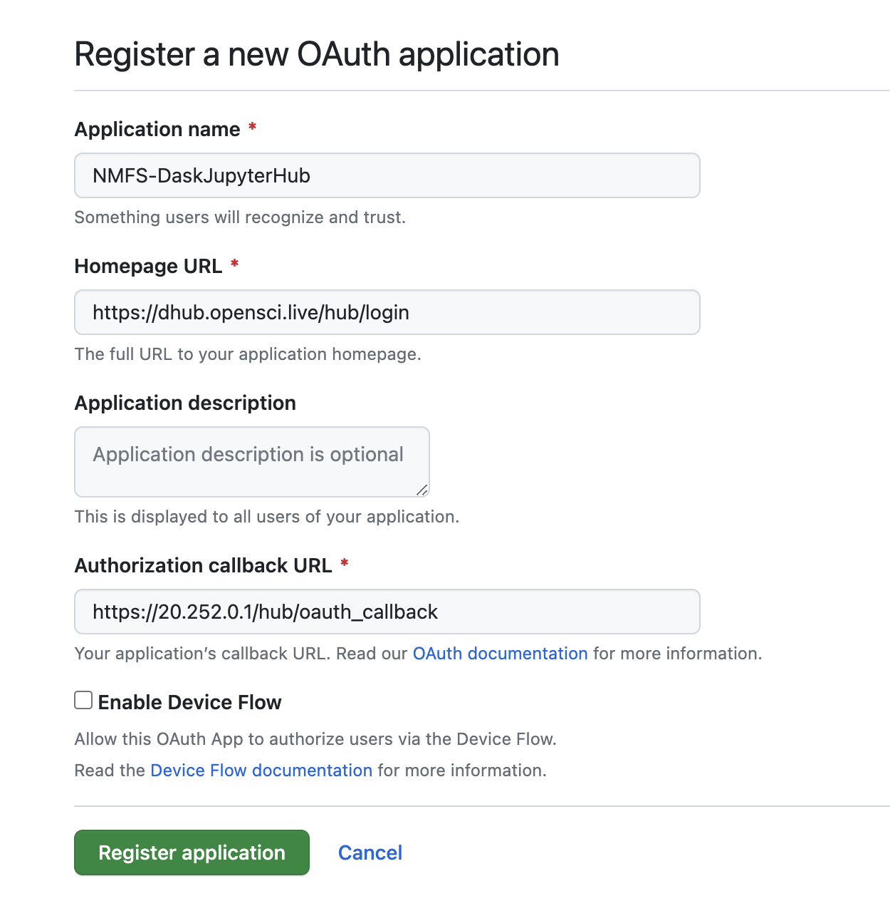
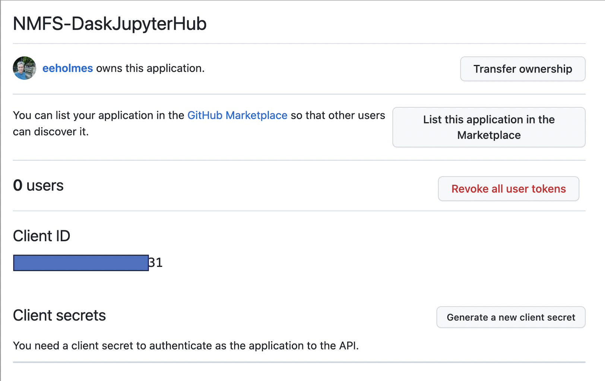
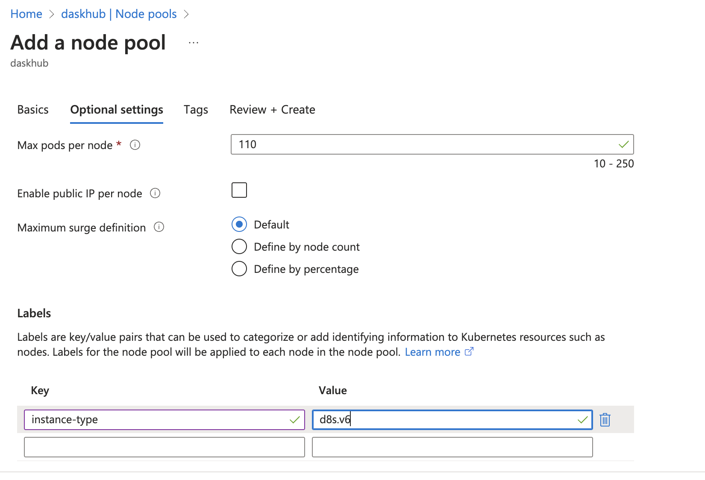

Setting up a multi-user JupyterHub with Dask enabled.

# Create your Kubernetes cluster

Log into `https:\\portal.azure.com`

1.  Get to the dashboard that looks similar to this.



2.  Click on the Kubernetes Services button and you should see something like this



3.  Click Create Kubernetes Cluster

At this point, you will get to the set-up with lots of tabs.

-   You need to select the resource group if you are in a subscription for an organization. Don't know what resource group to use, ask the admins.
-   You need to give your Kubernetes cluster a name. For example, `jhub` or `daskhub` or whatever.
-   You need to chose the AWS region. If you are using AWS S3 file access (big data in the cloud), then you need to be on the same region as the files you are accessing. Do you have no idea? Then you are probably not using AWS S3 file access. In that case, just go with the default or something close to you.
-   Next you chose the "Node size". This is the size of the base virtural machine (VM). It is going to spin up as many as it needs. The default is [Standard DS2 v2](https://azureprice.net/vm/Standard_DS2_v2) which as 2 CPU, 7 Gig RAM and 1T memory. This is fine for set-up. You can add more (bigger VMs later). Accept autoscaling since this is a multi-user hub.

The first tab is all you need for now. Later you may want to allow the user, to choose a different base VM. You can do that by adding node-pools. That'll be covered after the initial set-up. For now, just get your basic hub working. You can add more VM sizes later.

4.  Click "Review and Create"

Wait for validation tests to pass.

5.  Click "Create".

Once it is done deploying, you will see this.



# Install DaskHub on your cluster

These next steps are done in the shell after connecting to your cluster. First you need to get to the shell.

## Connect to your cluster

Once you have created your Kubernetes cluster, you want to go to its dashboard (by clicking on the name you gave it). You'll see something like this (I named mine `daskhub`).



Click on the Connect icon in the nav bar at top.

You then see this



Click on the link that says "Open Cloud Shell".



You will get to a terminal. Paste in the two commands in the previous image (the commands that show up for you that is).

## Create `dconfig.yaml`

This will be the configuration file for your Dask-enabled JupyterHub. For now, it can be just comments. Note the name is unimportant but should end in `.yaml`. I am using `dconfig.yaml` instead of `config.yaml` since I already have a `config.yaml` file for something else--and I have not figured out how to install different hubs in different directories or even different clusters in different directories (I have much to learn...).

```         
nano dconfig.yaml
```

This will open the nano editor. Edit your file. You can do `# just blank for now`. Then `Cntl-O` to save and `Cntl-X` to exit.

## Install daskhub via helm chart

Instructions: <https://artifacthub.io/packages/helm/dask/daskhub> .

Check that helm is installed

```         
helm version
```

Tell helm about the dask helm repository

```         
helm repo add dask https://helm.dask.org
helm repo update
```

Now install

```         
helm upgrade --wait --install --render-subchart-notes \
    dhub dask/daskhub \
    --namespace=dhub --create-namespace \
    --values=dconfig.yaml
```

You will see this on successful installation (it's long. much has been cut). 

## Set-up your external IP address

```         
kubectl config set-context $(kubectl config current-context) --namespace dhub
kubectl --namespace=dhub get service proxy-public
```

These commands will show the the IP address. Save the public IP address. You will need it in step 2. Look for the IP address under `EXTERNAL-IP`.

# Step 2 Set up https

You can log out of your cluster. The next steps are done elsewhere.

## Create a domain name

You will need a domain name for `https` which you want for security (and JHub won't stop complaining if you don't). Find a domain name provider and set one up. It is not expensive. I used GoDaddy.

## Create a DNS entry

Let's pretend you set up `bluemountain123.live` as the domain. Go to the DNS settings for your domain. Add a type A record. This will do 2 things. First this will create the subdomain that you will use to access your JupyterHub. So let's say you create, `dhub` as the type A DNS entry. Then `dhub.bluemountain123.live` will be the url. You can have as many subdomains as you need.


## Test if the url is working

`http:\\dhub.bluemountain123.live` would be the url using the example domain above. Test that it is working (shows a JupyterHub login) before moving on. This is what you should see:


## Set-up https on your JupyterHub

Log back into your Kubernetes cluster: go to portal.azure.com, click on your Kubernetes cluster name, and then click on "Connect". Then click on "Open Cloud Shell". [Read documentation about https](https://tljh.jupyter.org/en/latest/howto/admin/https.html)

Once you are on the shell, type

```         
nano dconfig.yaml
```

to edit the config file. Paste this in and save. Note the additional `jupyterhub:` in the yaml file. This is not in a plain JupyterHub with Kubernetes config file (i.e. in a non-daskhub, the `jupyterhub:` bit is not there and everything is moved to left by 2 spaces).

```         
jupyterhub:
  proxy:
    https:
      enabled: true
      hosts:
        - dhub.bluemountain123.live
      letsencrypt:
        contactEmail: your@email.com
```

## Update the JupyterHub installation

Anytime you change `dconfig.yaml` you need to run this code.

```         
helm upgrade --cleanup-on-fail --render-subchart-notes dhub dask/daskhub --namespace dhub --version=2023.1.0 --values dconfig.yaml
```

## Test if https is working

Try `https:\\dhub.bluemountain123.live` and you should see the JupyterHub login without that http warning.

# Step 3 Set up GitHub authentication

Optional, if you want to manage who can login via GitHub Team. I am going to show an example where I use a team on a GitHub organization to manage authentication. There are many other ways to manage users. Google to find that.

## Create a new Oauth Application on GitHub

This is going to be associated with your (personal) GitHub account, but you can use a team on a GitHub org that you are owner of.

Log into GitHub and go to GitHub \> Settings \> Developer Settings \> New Oauth Application

Look carefully at how I filled in the boxes.



Next you will see something like this



You need to copy the ID and then click the create secrets button and save the secret. Save those for later.

## Create a team in your GitHub org

You will be added by default and add anyone else who needs access to the hub. Let's say your org is `MyOrg` and the team is called `DaskHub`. So then the allowed organization is MyOrg:DaskHub. You can leave off `:DaskHub` if you want to allow all members of the organization to log in.

## Edit the `dconfig.yaml` file

```         
nano dconfig.yaml
```

Add to your config file so it is now this. Replace the id, secret and url with your values.

```         
jupyterhub:
  hub:
    config:
      GitHubOAuthenticator:
        client_id: <replace with your OAuth id>
        client_secret: <replace with your OAuth app secret>
        oauth_callback_url: https://dhub.bluemountain123.live/hub/oauth_callback
        allowed_organizations:
          - MyOrg:DaskHub
        scope:
          - read:org
      JupyterHub:
        authenticator_class: github
  proxy:
    https:
      enabled: true
      hosts:
        - dhub.bluemountain123.live
      letsencrypt:
        contactEmail: your@email.com        
```

## Update the hub

```         
helm upgrade --cleanup-on-fail --render-subchart-notes dhub dask/daskhub --namespace dhub --version=2023.1.0 --values dconfig.yaml
```

## Test

You should now see this and can authenticate with GitHub.


# Set up the container image

Now you need to specify the Docker image that will be used. We will use 2 different profiles: Python and R (RStudio).

Edit the `dconfig.yaml` file and add the user image info. Note the spacing matters (a lot). I also added some Dask gateway config.

```         
jupyterhub:
  hub:
    config:
      GitHubOAuthenticator:
        client_id: <replace with your OAuth id>
        client_secret: <replace with your OAuth app secret>
        oauth_callback_url: https://dhub.bluemountain123.live/hub/oauth_callback
        allowed_organizations:
          - MyOrg:DaskHub
        scope:
          - read:org
      JupyterHub:
        authenticator_class: github
  proxy:
    https:
      enabled: true
      hosts:
        - dhub.bluemountain123.live
      letsencrypt:
        contactEmail: your@email.com        
  singleuser:
    image:
      name: openscapes/python
      tag: f577786
    cmd: null
  singleuser:
    # Defines the default image
    image:
      name: openscapes/python
      tag: f577786
    profileList:
      - display_name: "Python3"
        description: "NASA Openscapes Python image"
        default: true
      - display_name: "R"
        description: "NASA Openscapes RStudio image"
        kubespawner_override:
          image: openscapes/rocker:a7596b5        
dask-gateway:
  gateway:
    extraConfig:
      idle: |-
        # timeout after 30 minutes of inactivity
        c.KubeClusterConfig.idle_timeout = 1800        
```

## Update the hub

```         
helm upgrade --cleanup-on-fail --render-subchart-notes dhub dask/daskhub --namespace dhub --version=2023.1.0 --values dconfig.yaml
```

## Changing the VM size

**NOT WORKING YET** I am stuck on creating the persistent volumes. Needed because you need the user storage somewhere if you have multiple node pools.



```         
kubectl get nodes --show-labels | grep instance-type
```

beta.kubernetes.io/instance-type=Standard_D8s_v3

## Create a persistent volume claim for user data

**NOT WORKING YET** Is this pvc.yaml right? Should I do this in the Azure dashboard instead?

```         
nana pvc.yaml
```

```         
kind: PersistentVolumeClaim
apiVersion: v1
metadata:
  name: hub-db-dir
  labels:
    component: jupyter
spec:
  storageClassName: "standard" # name of storage class, it will be default storage class if unspecified.
  accessModes:
    - ReadWriteOnce
  resources:
    requests:
      storage: "40Gi"
```

```         
kubectl create -f pvc.yaml
```

**What do I do next??**

# Troubleshooting

-   I cannot clone repos in the JupyterHub. Restart the server. In Jupyter, File \> Hub Control Panel \> Stop My Server.

# Refs I used

-   <https://github.com/zonca/jupyterhub-deploy-kubernetes-jetstream/blob/master/dask_gateway/dask-hub/config_daskhub.yaml>
-   <https://saturncloud.io/blog/how-to-setup-jupyterhub-on-azure/>
-   <https://saturncloud.io/blog/jupyterhub-and-azure-ad/>
