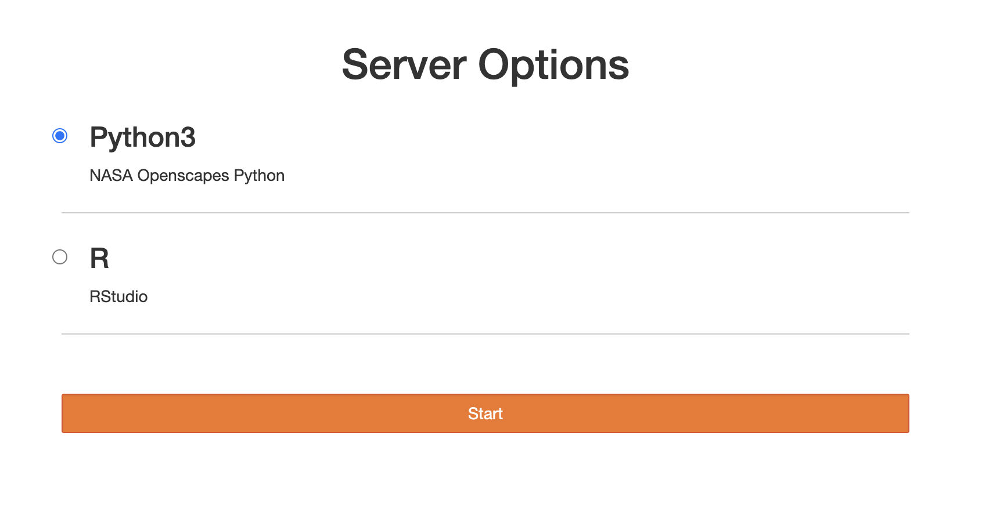
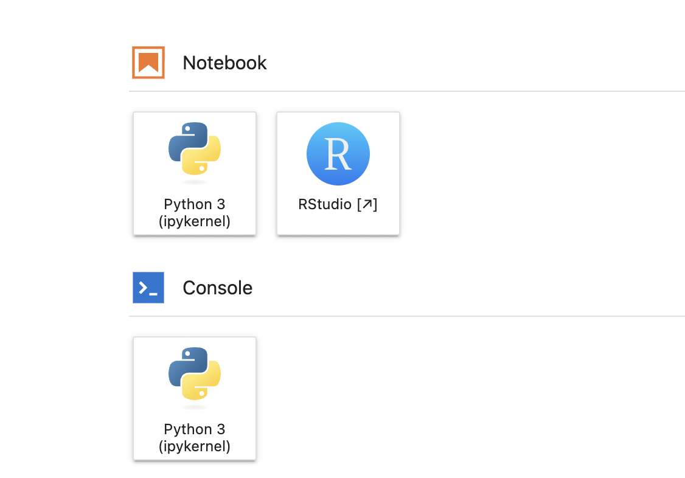

[Intro article](https://medium.com/@magstherdev/jupyterhub-on-kubernetes-c51953ae9ecd)

I have set us up a JupyterHub/RStudio cloud-computing hub on Azure. It's on Kubernetes and will spin up VMs as needed. The VMs are not huge: 2CPU & 8 Gig RAM.

<https://jhub.opensci.live/hub/login>

Login authentication is via GitHub. Only members of the JHub GitHub team can log on. This is a testing environment. Contact Eli if you want to test it out.

Instructions: It should be pretty self-explanatory.

* Chose Python or R
* It is based on the Openscapes docker images and is fairly full-featured but during testing let me know any libraries you need loaded.
* Does your work persist? Yes. It should be like your computer.
* Is there a limit to storage? Yes. I don't know what it is. Go ahead an use it so I can get a sense of storage needs.
* How do I link to my GitHub repositories? Follow these instructions https://snowex-2022.hackweek.io/preliminary/git.html


## Login

After you get paste the login page, you will see this. Choose Python for Python only; choose R for Python and R.



## Spin up your server

You will see this as your server spins up


## Choose your platform

You can code in RStudio, JupyterLab or Terminal.



## Let's choose RStudio


### Clone a repo

Choose 'new project' (top right) and Version Control.


### Tell Git who you are

Tell Git who you are and save your authentication info. You only do this once (or until your PAT expires). Run this code from the R console (not terminal).

```         
usethis::use_git_config(user.name = "YourName", user.email = "your@email.com")
```

Now create a personal access token for authentication. SAVE the token because you will need it in the next step.

```         
usethis::create_github_token() 
```

Now run this and paste in the token.

```         
gitcreds::gitcreds_set()
```

Restart R. You can chose your project from the dropdown on the top right to do this.

Now commit a change and push.

*Note, you can also run the commands below from a terminal window.*

```         
git config --global user.name "YourName"
git config --global user.email "your@email.com"
git config --global credential.helper store
```

## Let's choose JupyterLab

Any of the browser tabs with the Jupyter icon are JupyterLab.

Be careful because you can be in RStudio with one GitHub repository and you could open the same repo in JupyterLab and easily create merge conflicts. Just be aware that they are in separate file systems so changes on RStudio will not be reflected in JupyterLab. It is not like you are on one computer.

### Tell Git who you are

*But I just did that with RStudio!* I know but the JLab instance is in a different environment and doesn't know what you did in the RStudio environment.

Open a terminal. You do this from the Launcher window. You can always open a new launcher window by clicking the little + tab


Now click Terminal and run this code

```         
git config --global user.name "YourName"
git config --global user.email "your@email.com"
git config --global credential.helper store
```

-   Create a PAT or use the one you created for RStudio

-   Make a commit and push with the PAT as the password. Now you are set (until your PAT expires).

### Clone a Git repo

Click the Git icon on the left and you can clone a repo.


You can also clone from the terminal with
```
cd ~
git clone <url to repo>
```

## Stop your server

It will stop on it's own after awhile, but if it hangs, you can stop it and restart it. With File \> Hub Control Panel


## Using your own conda environment 


The following commands are entered in a terminal window.

Create a place in your home directory to keep your conda environments
```
cd ~
mkdir envs
```

Create the new environment and create a kernel for it. The environment must contain `ipykernel` (Python) or `irkernel` (R). Note use of `-p` instead of `-n` this is telling conda to create the environment in the current location and not the conda directory (which will be recreated every time the server restarts).
```
conda deactivate
conda create -p ~/envs/myenv numpy ipykernel
conda activate myenv
python -m ipykernel install --user --name myenv
```
You need to make sure that you run the `ipykernel` command when you are in the activated new environment.

Wait a few minutes and then the conda environment will appear on the launcher and in the dropdown in the kernels when you start a notebook.

If you want to use an `environment.yaml` file make sure it includes `ipkernel` (Python) or `irkernel` (R). Example:

```
name: myenv
channels:
  - conda-forge
dependencies:
  - numpy
  - ipykernel
```
With an `environment.yaml` file, the create command is
```
conda create -p ~/envs/myenv -f environment.yaml
```

To remove the conda environment and kernel:
```
conda deactivate
conda remove -p ~/envs/myenv
jupyter kernelspec remove myenv
```
You can see the kernels with
```
jupyter kernelspec list
```

## Trouble-shooting

* Debugging https://test-zerotojh.readthedocs.io/en/latest/administrator/debug.html