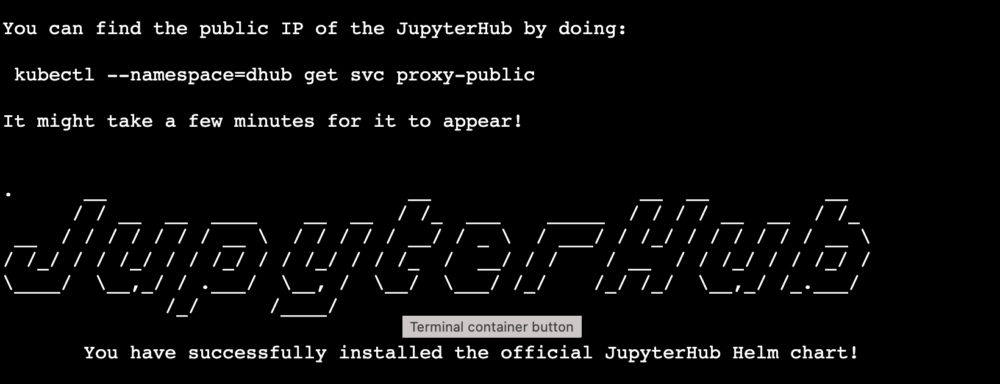
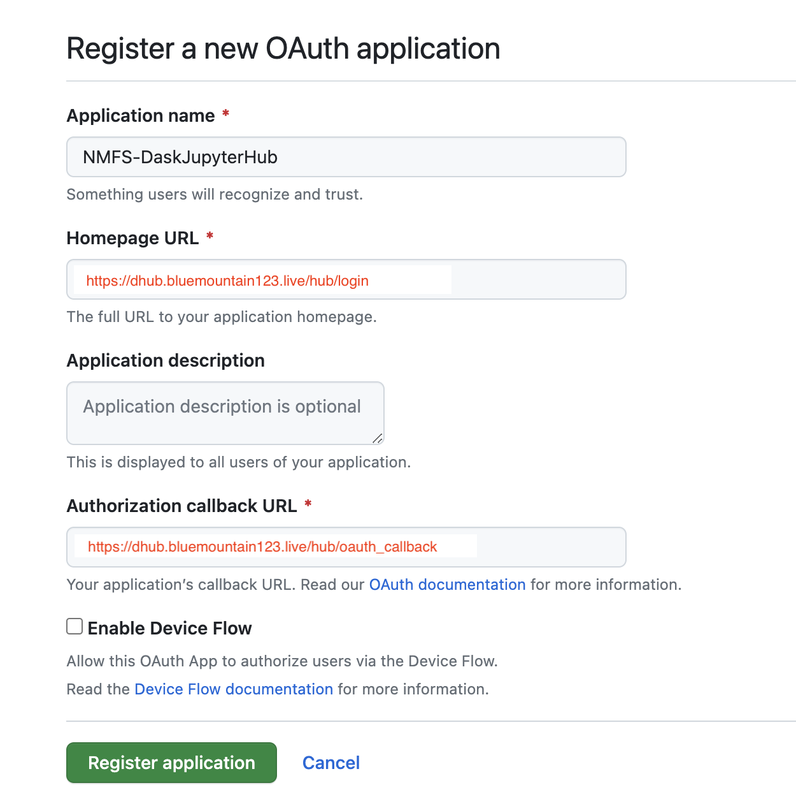

This is a fairly minimal JupyterHub. See the DaskHub examples for more complex set-ups.

## Requirements

- Documentation:  [https://z2jh.jupyter.org](https://z2jh.jupyter.org)

- Domain Name: You will need one. I use Godaddy. They are cheap.

### Steps

* Open the Azure Cloud Shell
* Create a Kubernetes cluster
* Create the node pools (what types of VMs)
* Install JupyterHub with Dask
* Edit the config file
* Set up https
* Set up authentication

## Open the Azure Cloud Shell

I am using a simpler version of the instructions here: [Z2JH Set up Kubernetes on Azure](https://z2jh.jupyter.org/en/stable/kubernetes/microsoft/step-zero-azure.html). 
To see how to do these steps using the Azure Dashboard go to the [DaskHub Set-up on Azure](posts/Set-up-daskhub.html). If this is your first time setting up a hub on Azure, it would be good to skim that post to get an overview of the process.

1. Log into `https:\\portal.azure.com`

2. Look for the Cloud Shell icon in the top nav bar. Box with a right pointing arrow in it. Click on that and use bash shell not the Power Shell.

3. Make sure to set up a storage account. You can just have Azure set one up for you. If you forget and later get warnings that your shell is ephemeral, then go into settings in the cloud shell and reset the user settings.

## Create your Kubernetes cluster

We have to create a resource group. 

```
# Create names
RES_GP="jhub"
CLUSTER_NAME="jhub"

# Create a resource group
az group create \
   --name=$RES_GP \
   --location=westus2 \
   --output table
```

Then we create a cluster with [az aks create](https://learn.microsoft.com/en-us/cli/azure/aks?view=azure-cli-latest#az-aks-create). I am going to accept most of the defaults. This will create our cluster and create the first node pool which just runs the hub (not the user VMs). This node (VM) must always be running and there is only ever one (so no autoscaling).

```
az aks create \
   --name $CLUSTER_NAME \
   --resource-group $RES_GP \
   --node-vm-size Standard_D2s_v3 \
   --generate-ssh-keys \
   --node-count 1 \
   --nodepool-name core \
   --nodepool-labels hub.jupyter.org/node-purpose=core \
   --zones 2 \
   --location westus2
```

* `--name` name of our cluster. I made a variable called `$HUB_NAME`
* `--node-vm-size Standard_D2s_v3` This is a 2 CPU and 4 Gb RAM VM to run the hub itself (so not the user VMs). Costs about $80 a month.
* `--generate-ssh-keys` Just use the default generator.
* `--node-count 1` There is only ever one core node which the hub server runs alone on.
* `--nodepool-name core` Required. This is the name of the node pool for the hub.
* `--nodepool-labels hub.jupyter.org/node-purpose=core` so that when you do queries re the nodes and pods, you can make sense of the output.
* `--zones 2` Probably not needed here. Only needed for user pods.
* `--location westus2` Required. Pick something close. use `az account list-locations --output table` to see a list of the options.
* `--output table` So that output is pretty.

## Create user node pools

Create the 4Gb RAM w 2 CPU node pool.
```
az aks nodepool add \
    --cluster-name $CLUSTER_NAME \
    --resource-group $RES_GP \
    --name user \
    --enable-cluster-autoscaler \
    --min-count 0 \
    --max-count 4 \
    --node-vm-size Standard_D2s_v3 \
    --labels hub.jupyter.org/node-purpose=user \
    --zones 2
```
* `--name user`  give this node pool a unique name. We will need this in our JHub config file.
* `--enable-cluster-autoscaler` Required. We want more VMs to be spun up if more users sign into the hub.
* `--min-count 0` We want the minimum to be 0 because if there are no users, then we don't need a user VM (node) to be running and costing money.
* `--max-count 4`
* `--zones 2` Very important. We have to pin our user storage to a specific region and zone. We don't want our nodes (VMs) to ever spin up in a zone different than our user (cloud) storage.


## Install JupyterHub on your cluster

These next steps are done in the shell after connecting to your cluster. First you need to get to the shell **for your cluster**. Make sure you don't have the ephemeral warning when you launch your cloud shell.

### Connect to your cluster

Once you have created your Kubernetes cluster, you want to go to its dashboard (by clicking on the name you gave it). You'll see something like this (in this image the cluster is named `daskhub`).


Click on the Connect icon to the right of "+ Create". Then click on "Cloud Shell".

### Create `config.yaml`

```         
nano config.yaml
```

This will open the nano editor. Edit your file. You can do `# just blank for now`. Then `Cntl-O` to save and `Cntl-X` to exit.

### Install jupyterhub via helm chart

Instructions: <https://artifacthub.io/packages/helm/dask/daskhub> .

Check that helm is installed. It should be.

```         
helm version
```

Tell helm about the repository

```         
helm repo add jupyterhub https://hub.jupyter.org/helm-chart/
helm repo update
```

Now install. The first `dhub` is your release name and the second is the namespace name.

```         
helm upgrade --cleanup-on-fail \
  --install jhub jupyterhub/jupyterhub \
  --namespace jhub \
  --create-namespace \
  --version=3.3.7 \
  --values config.yaml
```

You will see this on successful installation (it's long. much has been cut). 

### Set-up your external IP address

Set the namespace context for the Kubernetes cluster and the the external IP address.
```         
kubectl config set-context $(kubectl config current-context) --namespace jhub
kubectl --namespace=jhub get service proxy-public
```

These commands will show the the IP address. Save the public IP address. You will need it in step 2. Look for the IP address under `EXTERNAL-IP`.

## Set up https

You can log out of your cluster. The next steps are done elsewhere.

### Create a domain name

You will need a domain name for `https` which you want for security (and JupyterHub won't stop complaining if you don't). Find a domain name provider and set one up. It is not expensive. I used GoDaddy. If you already have one, you don't need another. You create a subdomain under that.

### Create a DNS entry

Let's pretend you set up `bluemountain123.live` as the domain. Go to the DNS settings for your domain. Add a type A record. This will do 2 things. First this will create the subdomain that you will use to access your JupyterHub. So let's say you create, `dhub` as the type A DNS entry. Then `dhub.bluemountain123.live` will be the url. You can have as many subdomains as you need.


### Test if the url is working

`http:\\dhub.bluemountain123.live` would be the url using the example domain above. Test that it is working (shows a JupyterHub login) before moving on. This is what you should see:


### Set-up https on your JupyterHub

Log back into your Kubernetes cluster: go to portal.azure.com, click on your Kubernetes cluster name, and then click on "Connect". Then click on "Open Cloud Shell". [Read documentation about https](https://tljh.jupyter.org/en/latest/howto/admin/https.html)

Once you are on the shell, type

```         
nano config.yaml
```

to edit the config file. Paste this in and save. 
```         
proxy:
  https:
    enabled: true
    hosts:
      - dhub.bluemountain123.live
    letsencrypt:
      contactEmail: your@email.com
```

### Update the JupyterHub installation

Anytime you change `config.yaml` you need to run this code. Find the latest version [here](https://artifacthub.io/packages/helm/dask/daskhub).

```         
helm upgrade --cleanup-on-fail \
  --install jhub jupyterhub/jupyterhub \
  --namespace jhub \
  --create-namespace \
  --version=3.3.7 \
  --values config.yaml
```

### Test if https is working

**COME BACK IN AN HOUR** It takes awhile for a certificate to be issued. If it still doesn't work, try editing the config file and re-upgrading.

Try `https:\\dhub.bluemountain123.live` and you should see the JupyterHub login without that http warning.

## Set up GitHub authentication

I am going to show an example where I use a team on a GitHub organization to manage authentication. There are many other ways to manage users. Google to find that.

### Create a new Oauth Application on GitHub

This is going to be associated with your (personal) GitHub account, but you can use a team on a GitHub org that you are owner of.

Log into GitHub and go to GitHub \> Settings \> Developer Settings \> Oauth Apps \> Register New Oauth Application

Look carefully at how I filled in the boxes.



Next you will see something like this


You need to copy the ID and then click the create secrets button and save the secret. Save those for later.

### Create a team in your GitHub org

You will be added by default and add anyone else who needs access to the hub. Let's say your org is `MyOrg` and the team is called `DaskHub`. So then the allowed organization is MyOrg:DaskHub. You can leave off `:DaskHub` if you want to allow all members of the organization to log in.

### Edit the `config.yaml` file

```         
nano config.yaml
```

Add to your config file so it is now this. Replace the id, secret and url with your values. 

```         
hub:
  config:
    GitHubOAuthenticator:
      client_id: <replace with your OAuth id>
      client_secret: <replace with your OAuth app secret>
      oauth_callback_url: https://dhub.bluemountain123.live/hub/oauth_callback
      allowed_organizations:
        - MyOrg:DaskHub
      scope:
        - read:org
    JupyterHub:
      authenticator_class: github
    KubeSpawner:
      working_dir: /home/jovyan
proxy:
  https:
    enabled: true
    hosts:
      - dhub.bluemountain123.live
    letsencrypt:
      contactEmail: your@email.com        
```

### Update the hub

whenever you make a change

### Test

You should now see this and can authenticate with GitHub.


## Set up the container image

Now you need to specify the Docker image that will be used.
Edit the `config.yaml` file and add the user image info. Note the spacing matters (a lot). 

The full (minimal) config file looks like:
```         
hub:
  config:
    GitHubOAuthenticator:
      client_id:  xxxxxx
      client_secret: xxxxx
      oauth_callback_url: https://jhub.opensci.live/hub/oauth_callback
      allowed_organizations:
        - nmfs-opensci:JHub-CloudTesters
      scope:
        - read:org
    JupyterHub:
      authenticator_class: github

proxy:
  https:
    enabled: true
    hosts:
      - jhub.opensci.live
    letsencrypt:
      contactEmail: eli.holmes@noaa.gov

singleuser:
  image:
    name: openscapes/python
    tag: f577786
  cmd: null
singleuser:
  # Defines the default image
  image:
    name: openscapes/python
    tag: f577786
  profileList:
    - display_name: "Python3"
      description: "NASA Openscapes Python image"
      default: true
    - display_name: "R"
      description: "NASA Openscapes RStudio image"
      kubespawner_override:
        image: openscapes/rocker:a7596b5
```

