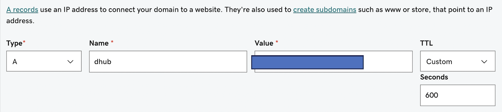
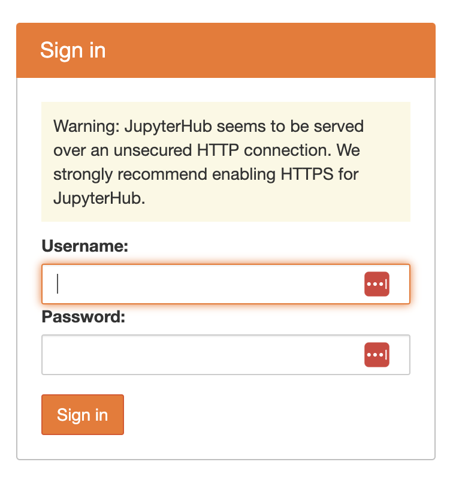

## Background

  - Documentation:  [https://z2jh.jupyter.org](https://z2jh.jupyter.org)
  - Help forum:     [https://discourse.jupyter.org](https://discourse.jupyter.org)
  - Issue tracking: [https://github.com/jupyterhub/zero-to-jupyterhub-k8s/issues](https://github.com/jupyterhub/zero-to-jupyterhub-k8s/issues)
  
See examples of full `config.yaml` files in the `config` directory in the [nmfs-opensci/nmfs-jhub](https://github.com/nmfs-opensci/nmfs-jhub) GitHub repo.

## Set-up Google Cloud

1. Create a Google Cloud account. Activate Compute API. It'll be one of the options.

2. Create a project. There is a button somewhere. 

3. Open the Cloud Shell. Look for 'Connect' or if you don't see that look for the icon in top right that looks like box with `>_` in it.

## Set-up Kubernetes cluster

Note, you'll likely be asked to activate the Kubernetes API. It gave me a link to do so and I clicked that.

Once you are inside the Cloud Shell, you create a Kubernetes cluster. This is a simple example. Create the cluster and add the admin. Use your email that you use for your Google Cloud account. You don't need a big machine type here. This just runs the Kubernetes bit; it is not running computations.

```
gcloud container clusters create \
  --machine-type n1-standard-2 \
  --num-nodes 2 \
  --zone us-west1-a \
  --cluster-version latest \
  jhub

kubectl create clusterrolebinding cluster-admin-binding \
  --clusterrole=cluster-admin \
  --user=yourname@gmail.com
```
Here `jhub` is the name I gave the cluster. You will need this name in many places so don't make it too long. Choose a zone with a region and letter. For me, I have run into problems if I don't pin the region (us-west1, us-east1, etc) to a zone (a, b, c).

Next create the node pools for users. Here is where you might want bigger machines. How much RAM users get will be specified in your `config.yaml` and that will determine how many users per node. So if you will have lots of users, then you need to have a big `max-nodes`.

```
gcloud beta container node-pools create user-pool \
  --machine-type n1-standard-2 \
  --num-nodes 0 \
  --enable-autoscaling \
  --min-nodes 0 \
  --max-nodes 3 \
  --node-labels hub.jupyter.org/node-purpose=user \
  --node-taints hub.jupyter.org_dedicated=user:NoSchedule \
  --zone us-west1-a \
  --preemptible \
  --cluster jhub
```
The `jhub` is the name of the cluster I set when I created the cluster.

## install helm 3

Install and check version installed.

```
curl https://raw.githubusercontent.com/helm/helm/HEAD/scripts/get-helm-3 | bash
helm version
```

Set up the `config.yaml` file. Just dummy for now.

```
nano config.yaml
```

Copy this in and then Cntl-O and return to save and then Cntl-X to exit

```
# Chart config reference:   https://zero-to-jupyterhub.readthedocs.io/en/stable/resources/reference.html
# Chart default values:     https://github.com/jupyterhub/zero-to-jupyterhub-k8s/blob/HEAD/jupyterhub/values.yaml
#
```

## Install JupyterHub

Add the repository where we will install from.
```
helm repo add jupyterhub https://hub.jupyter.org/helm-chart/
helm repo update
```

Install
```
helm upgrade --cleanup-on-fail \
  --install jhub1 jupyterhub/jupyterhub \
  --namespace jhubk8 \
  --create-namespace \
  --version=3.3.4 \
  --values config.yaml
```

The variables: `jhub1` is the name of the JupyterHub. You could have many on this Kubernetes cluster. We will only have 1 however. `jhubk8` is the namespace of all the assets that will be associated with this JupyterHub. All your storage (pvc) will appear in this namespace and you will have to add `--namespace jhubk8` to commands where you are trying to list or debug assets (like storage or killing nodes that are stuck). `config.yaml` is the file that has all the configuration settings.

## Connect to the JupyterHub

Now it is running. Let's try connecting via the External IP address

```
kubectl --namespace jhubk8 get service proxy-public
```
It will show you the public (external) IP address. You should be able to go to that with `http://` and you will see the log in page. Note you will not be able to log in as we did not create any users in the hub node (where the JupyterHub is running).

## Set-up https

This will be required for setting up authentication and also security.

### Create a domain name

Find a domain name provider and set one up. It is not expensive. I used GoDaddy.

### Create a DNS entry

Let's pretend you set up `bluemountain123.live` as the domain. Go to the DNS settings for your domain. Add a type A record. This will do 2 things. First this will create the subdomain that you will use to access your JupyterHub. So let's say you create, `dhub` as the type A DNS entry. Then `dhub.bluemountain123.live` will be the url. You can have as many subdomains as you need.



### Test if the url is working

`http:\\dhub.bluemountain123.live` would be the url using the example domain above. Test that it is working (shows a JupyterHub login) before moving on. This is what you should see:



### Set-up https on your JupyterHub

Log back into your Kubernetes cluster, by going to your project on Google Cloud and clicking the Cloud Shell icon in the top right (box with `>_`). Once you are on the shell, type

```         
nano config.yaml
```

Paste this in and save (Cntl-O, return and then Cntl-X to exit). The `traefik` bit is specific to GCP. Often people have trouble with GCP cluster spinning up too fast and it can't find the letsencrypt certificate. A small delay prevents that problem. This is just for GCP. I never had that problem on Azure.

```         
proxy:
  traefik:
    extraInitContainers:
      # This startup delay can help the k8s container network find the 
      # https certificate and allow letsencrypt to work in GCP
      - name: startup-delay
        image: busybox:stable
        command: ["sh", "-c", "sleep 10"]
  https:
    enabled: true
    hosts:
      - dhub.bluemountain123.live
    letsencrypt:
      contactEmail: yourname@gmail.com
```

### Update the JupyterHub installation

Anytime you change `config.yaml` you need to run this code. Replace the variables (like `jhub1`) with your names. `jupyterhub/jupyterhub` is specific to the helm chart; don't change that. 

```         
helm upgrade --cleanup-on-fail   --install jhub1 jupyterhub/jupyterhub   --namespace jhubk8   --create-namespace   --version=3.3.4   --values config.yaml
```

### Test if https is working

Try `https:\\dhub.bluemountain123.live` and you should see the JupyterHub login without that http warning.

## Set up authentication

See the post on [setting up authentication](set-up-authentication.html) for instructions.

## Deleting the Kubernetes cluster

* Go to dashboard. Make sure you are in the project with the Kubernetes cluster. 
* Click on the Kubernetes API button and then click on the cluster with your JHub
* At that point, you will see the delete button at the top. Click that.
* Wait awhile and make sure all the associated VMs and storage are deleted. 
* Go back onto billing in a few days and make sure it is not charging you. If it is, something associated with the JHub didn't get deleted.

## Post-installation checklist

* Verify that created Pods enter a Running state: `kubectl --namespace=jhubk8 get pod`
* If a pod is stuck with a Pending or ContainerCreating status, diagnose with: `kubectl --namespace=jhubk8 describe pod <name of pod>`
* If a pod keeps restarting, diagnose with: `kubectl --namespace=jhubk8 logs --previous <name of pod>`
* Verify an external IP is provided for the k8s Service proxy-public. `kubectl --namespace=jhubk8 get service proxy-public`
* If the external ip remains <pending>, diagnose with: `kubectl --namespace=jhubk8 describe service proxy-public`

